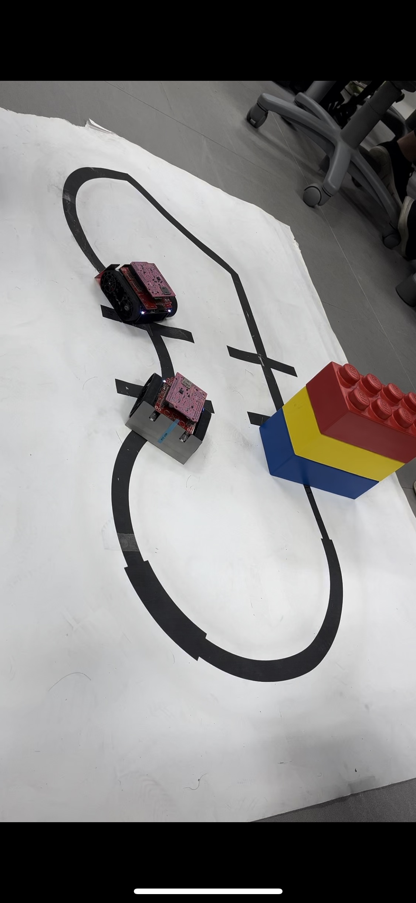
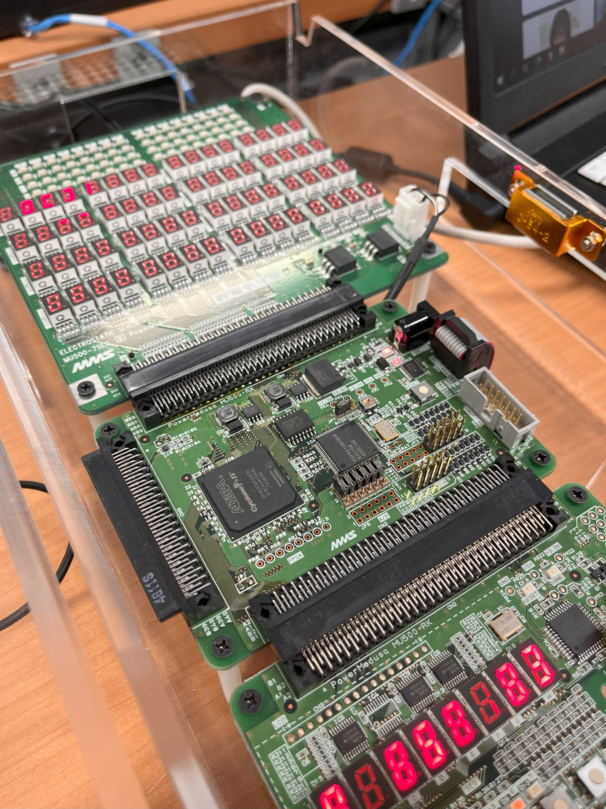

# Outline
## Purpose
This repository has been created to save the records of our efforts on hardware experiments.

## Target
For the subject "Electrical engineering and computer science experiment I" in the 3rd semester of the Course of Computer Science, Department of Electrical Engineering and Computer Science, Faculty of Engineering, Kyushu University.

## Notes
- In order to avoid copyright issues, I do not publish any code or files which are not created by myself (including top modules).
- Please access the subject course website for more details.

# Updates
- v1.0 (2024-01-28)
  - Initial release.
  - [Note] My processor code in directory `2_hardware-exp-II` does not work. Debug is required.

# Repository structure
| Directory | Period | Description |
|:--|:--| :--|
| 0_robot-distribution-project | 2023-04-12 ~ 2023-05-01 (9 times) | Group development, Arduino, Network, Sensors |
| 1_hardware-exp-I | 2023-05-08 ~ 2023-05-22 (7 times) | Fundamentals of CPU processing and Verilog-HDL |
| 2_hardware-exp-II | 2023-05-24 ~ 2023-07-05 (19 times) | CPU processor developement |
| 3_hardware-exp-III | 2023-07-06 ~ 2023-07-20 (6 times) | Group development, creative applications |

# Project outline
- The entire subject is divided into 4 projects.
- Participants are divided into groups of 6 people. This situation continues until the end of the subject.
## 0_robot-distribution-project
- We simulate a rescue scene using two Zumo robots.
- Role
  - Both robots are equally-equipped with network modules, sensors, and motors.
  - Robot A: Robot to be rescued.
  - Robot B: Robot to rescue Robot A.
- Stroy flow
  1. Robot A moves and encounters a traffic accident, and then sends ping signals to Robot B.
  2. Robot B receives the ping signal and moves to the accident site.
  3. Robot B sends a ping signal to Robot A.
  4. Both robots move to the goal point.
- Tech
  - (both) Photo-resistor to detect the light.
  - (both) Motor to move tires for driving.
  - (both) Network module to communicate with each other via Wi-Fi.
  - (A) Gravity sensor to detect impact.

## 1_hardware-exp-I
- The main purpose of this project is to learn about the CPU processing.
- In the beginning, we learn about the fundamentals of CPU processing and programming language Verilog-HDL.
- You will learn how to use the FPGA board and how to process incoming machine language.

## 2_hardware-exp-II
- You develop a CPU processor using Verilog-HDL. This is the main project of this subject.
- For details, refer to a textbook to be distributed in the class.

## 3_hardware-exp-III
- Using CPU and its peripherals, we develop a creative application.
- You will develop a creative application cooperatively with your group members.

# Thanks
I deeply appreciate my group members for their collaborations with me and contributions for this experiment. 

# Experiment images
For more details, we have videos of robot simulations and CPU board processing. Feel free to contact me, for example, to my email address in profile.

